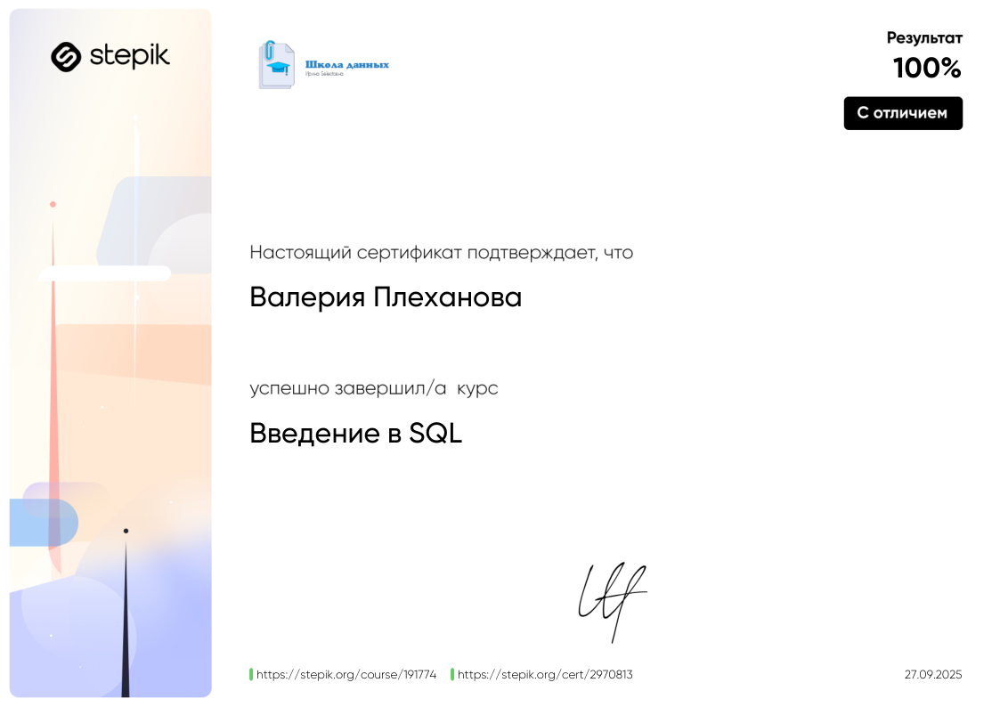
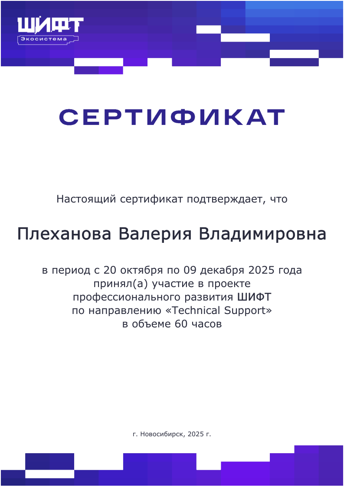

## Привет, меня зовут Валерия 👋

### О себе
Junior аналитик данных с техническим образованием и инженерным бэкграундом.
Имею опыт аналитической и расчетной работы, анализа параметров и выбора оптимальных решений.
Рассматриваю позиции Junior/Trainee Data Analyst или SQL Analyst.
### Навыки
**SQL:** SELECT, WHERE, GROUP BY, HAVING, JOIN, подзапросы, оконные функции;  
**Python:** pandas, numpy, Matplotlib (EDA, очистка и базовый анализ данных);  
**Tools:** SQLite, MySQL, Jupyter Notebook, Excel, Mathcad, Matlab. 
### Дополнительное обучение

**Обучение SQL** 
  
**Обучение. Проект ШИФТ** 

